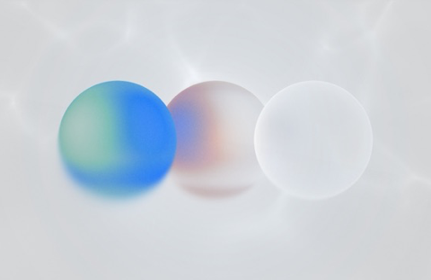

# Liquid Gas Screensaver

A macOS screensaver that renders a liquid glass shader composition: three glass orbs floating over animated water caustics. Automatically follows the system Light/Dark Mode setting and smoothly blends between the existing light and dark backgrounds when the system appearance changes.



## Install (prebuilt)

Grab `liquid-glass-screensaver.zip` from the [latest release](https://github.com/destefanis/liquid-glass-screensaver/releases/latest), unzip, and double-click the `.saver` (or copy it to `~/Library/Screen Savers/`), then select it in System Settings → Screen Saver. The build is Developer ID-signed and notarized.

## Build & Install

```sh
xcodebuild -project liquid-glass-screensaver.xcodeproj -scheme liquid-glass-screensaver -configuration Release build
cp -R ~/Library/Developer/Xcode/DerivedData/liquid-glass-screensaver-*/Build/Products/Release/liquid-glass-screensaver.saver ~/Library/Screen\ Savers/
killall legacyScreenSaver 2>/dev/null
```

Then pick **liquid-glass-screensaver** in System Settings → Screen Saver. **Options…** has a fresnel glow slider; the saver follows the system appearance automatically.

(Or open the project in Xcode, ⌘B, and copy the built `.saver` to `~/Library/Screen Savers/`.)

## Building Your Own Metal Screensaver

Start from Xcode's **macOS → Screen Saver** template, then apply these. Each one is a hard-won fix for how modern macOS hosts screensavers:

1. **Swift principal class.** The template is Obj-C. For Swift, name your view `@objc(your_principal_class_name)` to match `NSPrincipalClass` in the build settings, and add `SWIFT_VERSION` to the project.
2. **Load your Metal library from the saver's bundle.** `device.makeDefaultLibrary()` resolves against the *host app* (`legacyScreenSaver`), not your bundle, and silently fails. Use `makeDefaultLibrary(bundle: Bundle(for: YourClass.self))`.
3. **Drive rendering yourself.** Run the `MTKView` with `isPaused = false` and its own display link. The host drops `animateOneFrame`/`startAnimation` calls when it gets into a bad state; a saver that depends on them renders black.
4. **Exit the host process when your saver stops.** Observe the `com.apple.screensaver.willstop` distributed notification (and `NSWorkspace.willSleepNotification`) and call `exit(0)`. Without this the host process wedges: Preview works exactly once and the process lingers until killed in Activity Monitor. See the comments in `LiquidGlassScreensaverView.swift`.
5. **Thumbnail.** Ship a `thumbnail.png` (~480×312) *and* set `ScreenSaverThumbnail` in Info.plist; the file alone isn't read.
6. **Iterating.** macOS caches savers aggressively. After each install: `killall legacyScreenSaver` and reopen System Settings.

## License

MIT
